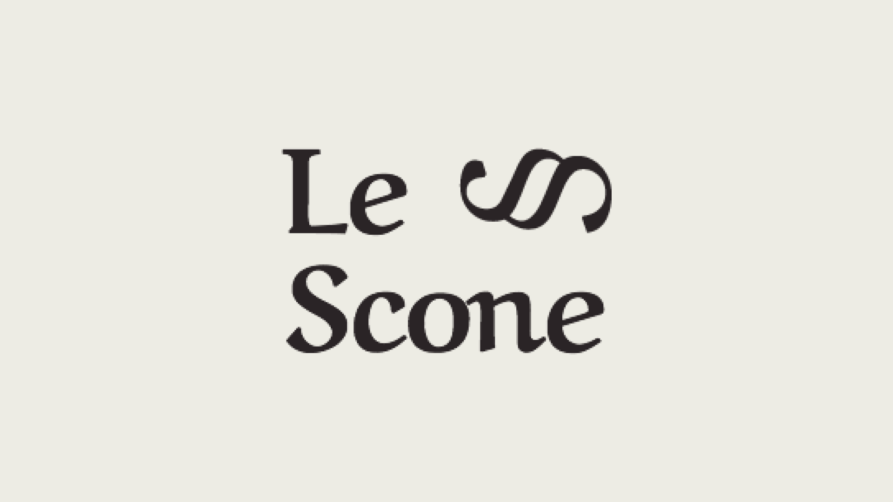

## 📌 Índice

- [Sobre](#-sobre)
- [Tecnologias utilizadas](#-tecnologias-utilizadas)
- [Como baixar o projeto](#-como-baixar-o-projeto)

---

## 🔖 Sobre

Durante o curso, foi apresentado as diversas funcionalidades que o SASS permite adicionar na construção do CSS (variáveis, mixins, nesting, operadores, condicionais, funções, loop, extend entre outros).

A melhor parte é poder criar um sistema de grid para auxiliar na estrutura do seu site e é totalmente responsivo.

Foi projetado uma landing page para consolidar o conhecimento adquirido durante o curso, o link do código está logo abaixo. Para quem está familiarizado com CSS, vai perceber que o código não utiliza as funcionalidades mais recentes, pois o foco principal foi entender como que o SASS funciona e por isso não foi otimizado.

<h3 align="center">
    <a href="https://bagrielz.github.io/bikcraft-project/">Acessar a demonstração</a>
<h3>

---

## 🚀 Tecnologias utilizadas

O projeto foi desenvolvido utilizando as seguintes tecnologias:

- [HTML](https://developer.mozilla.org/pt-BR/docs/Web/HTML)
- [SCSS](https://sass-lang.com/)

---

## 🗂 Como baixar o projeto

```bash
    # Clonar o repositório
    $ git clone https://github.com/bagrielz/bikcraft-project

    # Entrar no diretório
    $ cd lescone-project
```

---

Desenvolvido 🤘 por Gabriel Stênio, direitos do projeto **Origamid**
